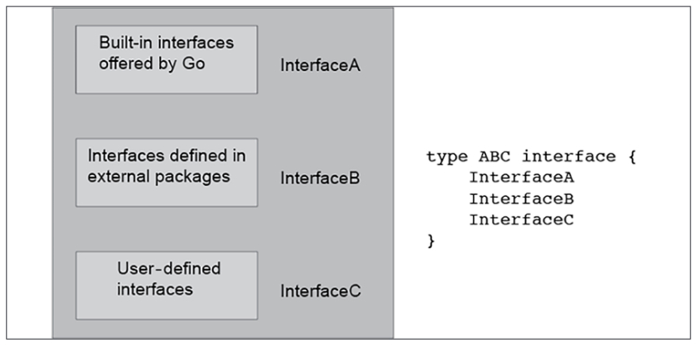

# Chapter 4: Reflection and Interfaces

Interfaces are about expressing abstractions and identifying and defining behaviors that can be shared among different data types. Once you have implemented an interface for a data type, a new world of functionality becomes available to the variables and the values of that type, which can save you time and increase your productivity. Interfaces work with methods on types or type methods, which are like functions attached to given data types, which in Go are usually structures. Remember that once you implement the required type methods of an interface, that interface is satisfied implicitly, which is also the case with the empty interface that is explained in this chapter. 

Another handy Go feature is reflection, which allows you to examine the structure of a data type at execution time. However, as reflection is an advanced Go feature, you do not need to use it on a regular basis. 

## Reflection
If you want to find out the names of the fields of a structure at execution time, you need to use reflection. Apart from that, reflection also allows you to explore and manipulate unknown structures like the ones created from decoding JSON data.

Reflection allows you to dynamically learn the type of an arbitrary object along with information about its structure. Additionally, eflection might come in handy when you have to work with data types that do not implement a common interface and therefore have an uncommon or unknown behavior.

reflect.Value is used for storing values of any type, whereas reflect.Type is used for representing Go types. There exist two functions named reflect.TypeOf() and reflect.ValueOf() that return the reflect.Type and reflect.Value values, respectively. Note that reflect.TypeOf() returns the actual type of variable - if we are examining a structure, it returns the name of the structure. <br> reflect.NumField() => listing the number of fields in a structure. <br> reflect.Field() => getting reflect.Value value of a specific field of a structure. <br> reflect.King => representing the specific data type of a variable: int, struct, etc.

\* Reflection code can look unpleasant and hard to read sometimes. Therefore, according to the Go philosophy, you should rarely use reflection unless it is absolutely necessary because despite its cleverness, it does not create clean code. 

example usage:
```
type Secret struct {
Username string
Password string
}

type Record struct {
Field1 string
Field2 float64
Field3 Secret
}

r := reflect.ValueOf(A)
fmt.Println("String value:", r.String())
=> String value: <main.Record Value>

iType := r.Type()
fmt.Printf("i Type: %s\n", iType)
fmt.Printf("The %d fields of %s are\n", r.NumField(), iType)
=> i Type: main.Record
=> The 3 fields of main.Record are

for i := 0; i < r.NumField(); i++ {
    fmt.Printf("\t%s ", iType.Field(i).Name)
    fmt.Printf("\twith type: %s ", r.Field(i).Type())
    fmt.Printf("\tand value _%v_\n", r.Field(i).Interface())
    => Field1 with type: string and value _String value_
    => Field2 with type: float64 and value _-12.123_
    => Field3 with type: main.Secret and value _{Mihalis Tsoukalos}_

    // Check whether there are other structures embedded in Record
    k := reflect.TypeOf(r.Field(i).Interface()).Kind()
    // Need to convert it to string in order to compare it
    if k == reflect.Struct {
        fmt.Println(r.Field(i).Type())
        => main.Secret
    }
}

```

If you were to make changes to the values of the structure fields, you would use the Elem()  method and pass the structure as a pointer to ValueOf(). There exist methods that allow you to modify an existing value. For example SetString() and SetInt().

### The three disadvantages of reflection
* The first reason is that extensive use of reflection will make your programs hard to read and maintain.
* The second reason is that the Go code that uses reflection makes your programs slower. Generally speaking, Go code that works with a particular data type is always faster than Go code that uses reflection to dynamically work with any Go data type. Additionally, such dynamic code makes it difficult for tools to refactor or analyze your code.
* The last reason is that reflection errors cannot be caught at build time and are reported at runtime as panics, which means that reflection errors can potentially crash your programs.


## Type methods
A type method is a function that is attached to a specific data type. Although type methods (or methods on types) are in reality functinons, they are defined and used in a slightly different way.

The methods on types feature gives some object-oriented capabilities to Go, which is very handy and is used extensively in Go. Additionally, interfaces require type methods to work.

\* Infact, each type method can be rewritten as a regular function. Have in mind that under the hodd, the Go compiler does turn methods into regular function calls with the self value as the first parameter. However, interfaces require the use of type methods to work. 

## Interfaces

An interface is a Go mechanism for defining behavior that is implemented using a set of methods. Interfaces play a key role in Go and can simplify the code of your programs when they have to deal with multiple data types that perform the same task. 

As you already know, once you implement the required type methods of an interface, that interface is satisfied implicitly.

The empty interface is defined as just interface{}. As the empty interface has no methods, it means that it is already implemented by all data types.

In a more formal way, a Go interface type defines (or describes) the behavior of other types by specifying a set of methods that need to be implemented for supporting that behavior. For a data type to satisfy an interface, it needs to implement all the type methods required by that interface. Therefore, interfaces are abstract types that specify a set of methods that need to be implemented so that another type can be considered and instance of the interface. So, an interface is two things: a set of methods and a type. Have in mind that small and well-defined interfaces are usually the most popular ones.

As a rule of thumb, only create a new interface when you want to share a common behavior between two or more concrete data types. This is basically duck typing.

The biggest advantage you get from interfaces is that if needed, you can pass a variable of a data type that implements a particular interface to any function that expects a parameter of that specific interface, which saves you from having to write separate functions ffor each supported data type. However, Go offers an alternative to this with the recent addition of generics.

Interfaces can also be used for providing a kind of polymorphism in Gi, which is an object-oriented concept. Polymorphism offers a way of accessing objects of different types in the same uniform way when they share a sommon behavior.

Lastly, interfaces can be used for composition. In practice, this means that you can combine existing interfaces and create new ones that offer the combined behavior of the interfaces that were brought together. The next figure shows interface composition in a graphical way.



Put simply, the previous figure illustrates that because of its definition, satisfying interface ABC requires satisfying InterfaceA, InterfaceB, and InterfaceC. Additionally, any ABC variable can be used instead of an InterfaceA variable, and InterfaceB variable, or an InterfaceC variable because it supports all these three behaviors. Last, only ABC variables can be used where an ABC variable is expected. There is nothing prohibiting you from including additional methods in the definition of the ABC interface if the combination of existing interfaces does not describe the desired behavior accurately.

What you should keep in mind is that there is no need for an interface to be impressive and require the implementation of a large number of methods. In fact, the fewer methods an interface has, the more generic and widely used it can be, which improves its usefulness and therefore its usage.

### The sort.Interface interface
The sort package contains an interface named sort.Interface that allows you to sort slices according to your needs and your data, provided that you implement sort.Interface for the custom data types stored in your slices.

In order to implement sort.Interface, we need to implement following three methods. Len() int, Less(i, j int) bool, Swap(i, j int)

### The empty interface 

As mentioned before, the empty interface is defined as just interface{} and is already implemented by all data types. Therefore, variables of any data type can be put in the place of a parameter of the empty interface data type. Therefore, a function with an interface{} parameter can accept variables of any data type in this place.

## Type assertions and type switches
A type assertion is a mechanism for working with the underlying concrete value of an interface. This mainly happens because interfaces are virtual data types without their own values - interfaces just define behavior and do not hold data of their own. 

Type switches use switch blocks for data types and allow you to differentiate between type assertion values, which are data types, and process each data type the way you want. On the other hand, in order to use the empty interface in type switches, you need to use type assertions.

Type assertions user the x.(T) notation, where x is an interface type and T is a type and help you extract the value that is hidden behind the empty interface. For a type assertion to work, x should not be nil and the synamic type of x should be identical to the T type.

```
func Teststruct(x interface{}) {
    // type switch
    switch T := x.(type) {
    case Secret:
        fmt.Println("Secret type")
    case Entry:
        fmt.Println("Entry type")
    default:
        fmt.Printf("Not supported type: %T\n", T)
    }
}
```

Strictly speaking, type assertions allow you to perform this task: <br>
* Checking whether an interface value keeps a particular type. Checking whether a variable named aVar is of the int type requires the use of the aVar.(int) notation, which returns two values. If successful, it returns the real int value of aVar and true. Otherwise, it returns false as the second value, which means that the type assertion was not successful and that the real value could not be extracted.

As explained, trying to extract the concrete value from an interface using a type assertion can have two outcomes:
* If you use the correct concrete data type, you get the underlying value without any issues
* If you use an incorrect concrete data type, your program will panic

```
func returnNumber() interface{} {
    return 12
}

func main() {
    anInt := returnNumber()
    number := anInt.(int)
    number++
    fmt.Println(number)
    // => 13

    // The next statement would fail because there
    // is no type assertion to get the value:
    // anInt++
    // The next statement fails but the failure is under
    // control because of the ok bool variable that tells
    // whether the type assertion is successful or not
    value, ok := anInt.(int64)
    if ok {
        fmt.Println("Type assertion successful: ", value)
    } else {
        fmt.Println("Type assertion failed!")
    }

    // The next statement is successful but
    // dangerous because it does not make sure that
    // the type assertion is successful.
    // It just happens to be successful
    i := anInt.(int)
    fmt.Println("i:", i)
    // The following will PANIC because anInt is not bool
    _ = anInt.(bool)
}
```

### Example code for using interface in the error data type
In order to satisfy the error interface you just need to implement the Error() string type method.

```
type error interface {
    Error() string
}

// Implement error interface
func (e emptyFile) Error() string {
    return fmt.Sprintf("Ended with io.EOF (%t) but read (%d) bytes",
    e.Ended, e.Read)
}

// Check values
// Here we can give variable of the emptyFile type as an input 
// variable of this function. Because emptyFile type implements Error() // function and so have the behavior of error type and can be used as an // error variable.

// We cast input variable of the function to emptyFile to detect whether // the variable has emptyFile type or not
func isFileEmpty(e error) bool {
    // Type assertion
    v, ok := e.(emptyFile)
    if ok {
        if v.Read == 0 && v.Ended == true {
        return true
        }
    }
    return false
}
```

### Writing your own interfaces
```
type Shape2D interface {
    Perimeter() float64
}
```
This interface has the following properties:
* It is called Shape2D
* It requires the implementation of a single method named Perimeter() that returns a float64 value

```
type circle struct {
    R float64
}

func (c circle) Perimeter() float64 {
    return 2 * math.Pi * c.R
}
```

The circle type implements the shape2D interface with the implementation of the Perimeter() type method.

```
func main() {
    a := circle{R: 1.5}
    fmt.Printf("R %.2f -> Perimeter %.3f \n", a.R, a.Perimeter())
    _, ok := interface{}(a).(Shape2D)
    if ok {
        fmt.Println("a is a Shape2D!")
    }
}
```

the interface{}(a).(Shape2D) notation checks whether the a variable satisfies the Sahep2D interface without using its underlying value.

