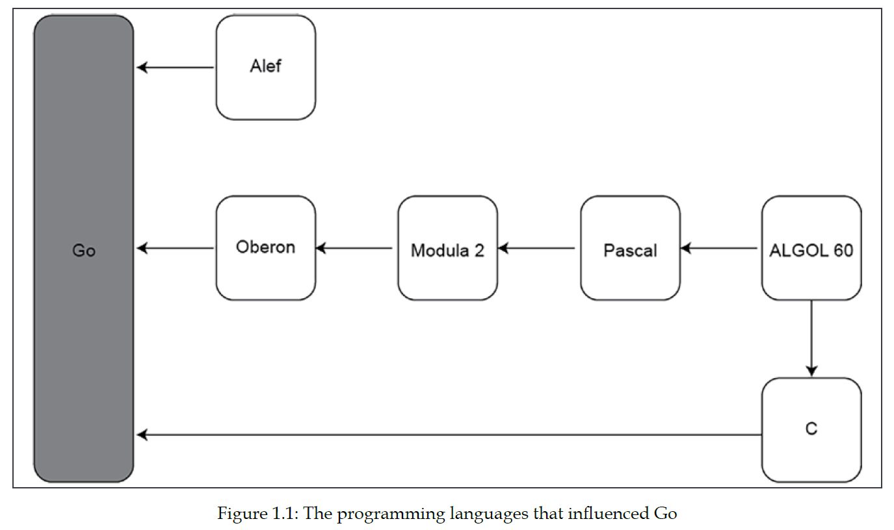

# Chapter 1:

Go is an open source programming language which initially developed as an internal Google project that went public back in 2009. The spritual fathers of Go are Robert Griesemer, Ken Thomson, and Rob Pike.

**Robert Griesemer**: 
Robert Griesemer (born 1964) is a Swiss computer scientist. He is best known for his work on the Go programming language. Prior to Go, he worked on Google's V8 JavaScript engine, the Sawzall language (programming language for logging made by Google), the Java HotSpot virtual machine, and the Strongtalk system. [Visit Wikipedia](https://en.wikipedia.org/wiki/Robert_Griesemer)

**Ken Thompson**: 
Kenneth Lane Thompson (born February 4, 1943) is an American pioneer of computer science. Thompson worked at Bell Labs for most of his career where he designed and implemented the original Unix operating system. He also invented the B programming language, the direct predecessor to the C programming language, and was one of the creators and early developers of the Plan 9 operating system. Since 2006, Thompson has worked at Google, where he co-developed the Go programming language.

Other notable contributions included his work on regular expressions and early computer text editors QED and ed, the definition of the UTF-8 encoding, and his work on computer chess that included the creation of endgame tablebases and the chess machine Belle. He won the Turing Award in 1983 with his long-term colleague Dennis Ritchie. [Visit Wikipedia](https://en.wikipedia.org/wiki/Ken_Thompson)

**Rob Pike**: 
Robert Pike (born 1956) is a Canadian programmer and author. He is best known for his work on the Go programming language while working at Google and the Plan 9 operating system while working at Bell Labs, where he was a member of the Unix team.

Pike wrote the first window system for Unix in 1981. He is the sole inventor named in the US patent for overlapping windows on a computer display.

With Brian Kernighan, he is the co-author of The Practice of Programming and The Unix Programming Environment. With Ken Thompson, he is the co-creator of UTF-8. [Visit Wikipedia](https://en.wikipedia.org/wiki/Rob_Pike)

 
Although the official name of the language is Go, it is sometimes wrongly referred to as Golang.The official reason for this is that og.org was not available for registrationand golang.org was chosen instead. And the practical reason for this is that when you are querying a search engine for Go, the word Go is usually interpreted as a verb.  

## Why Go is good?
There are many things that Go does better than other programming languages, including the following:

**Lack of verbosity**: Go uses fewer parentheses than C, C++, or Java, and no semicolons, which makes the look of Go source code more human-readable and less errorprone. 

Go was desingned and is currently maintained by real programmers. Go is easy to learn, has good-looking codes and easy to read.

Due to its simplicity, Go code is predictable and does not have strange side effects, and although Go supports pointers, it does not support pointer arithmetic like C, unless you use the unsafe package.

Go is not an object oriented language, but it supports capabilities of object oriented languages like polymorphism, encapsulation and composition.

**Concurrency**: Go has support for concurrency out of the box through goroutines and channels. 

**Compiler**: Actually, Go is a compiler language. Compiler languages usually excecute faster than interpreted languages. Because they don't compile code at runtime. Furthermore, Go don't need external VM like Java or C# for excecuting and running the code. So Go is faster than most of interpreted languages and some other langugaes like C# and Java. 

How ever C programs run faster than Go programmes. Because Go handles memory allocation itself and using its garbage collector. As far as memory and time is concerned, C programs run faster than Go programs. 

Is it worth mentioning that compiler languages like Go, make excecutable file that is a machine code and can run on other computers too. However, languages like Java and C# and python, make a interpreted file that it needs another step for converting this file to machine code. So every platform for reading this files must have there interpreters or VMs. In addition, for reading .exe files of compiler languges, this exe file just can run on the same os. As a result, if you want have exe file on different oses, you should make separate exe files for each os.

Finally, the default behavior of the Go compiler can catch a large set of silly errors that might result in bugs.

Go's executable binaries are statically linked, which means that once they are generated, they do not depend on any shared libraries and include all required information. 

**Richer libraries in comparison to some languages like C**: Developing with Go, is much easier than developing a program with C. Go has many libraries and also it is easier to understand and much simpler than C. For example unlike C, go supports functional programming. Means it supports more features than C and programmers are happier with Go. Although Go could be written completely functional, as far as simplicity is also concerned, they don't do this. Because the creatures of this language made this language to be used in various fields including networking, backend services command-line utilities and ... so it was important that everyone can work with this language.

**Garbage Collection**: Go comes with support for garbage collection, which means that no manual memory management
is needed. For some usecases that needed manual memory management, Go is not a good option. Because Go will now allow you to perform any memory management manually.

### The go doc and godoc utilities
The go doc subcommand and godoc utility, allow you to see the documentation of existing Go functions and packages without needing an internet connection.

The go doc command can be executed as a normal command-line application that
displays its output on a terminal, and godoc as a command-line application that
starts a web server.

`go doc fmt.Printf`

`godoc -http:8001`

## Hello world

The import keyword allows you to include functionality of the packages that belong to the standard Go library (os). Packages that are not part of the standard Go library are imported using their full internet path (github.com/spf13/cobra). Go programs are organized in packages - even the smallest Go  program should be deliveered as a package. 

### Differences between go build and go run
In order to compile Go code and create a binary executable file, you need to use the go build command. What go build does is create an executable file for you to distribute and execute manually. This means that the go build command requires an additional step for running your code.
go build supports the -o option, which allows you to change the filename and the path of the generated executable file.

`go build -o helloWorld hw.go`

The go run command builds the named Go package, which in this case is the main package implemented in a single file, creates a temporary executable file, executes that file, and deletes it once it is done—to our eyes, this looks like using a scripting language. In our case, we can do the following.

`go run hw.go`

\* Go offers standard tooling (gofmt) that can format your code for you so you never have to think about it.

\* Go requires the use of semicolons as statement terminators in many contexts, and the compiler automatically inserts the required semicolons when it thinks that they are necessary.

### Some differences between short assignment statement and var:
the var keyword is mostly used for declaring global or local variables without an initial value. The reason for the former is that every statement that exists outside of the code of a function must begin with a keyword such as func or var. This means that the short assignment statement cannot be used outside of a function environment because it is not available there. Last, you might need to use var when you want to be explicit about the data type. For example, when you want int8 or
int32 instead of int.

\* If no initial value is given to a variable, the Go compiler will automatically initialize that variable to the zero value of its data type.

### Implicit and explicit data and type conversions:
Implicit Type Conversion Also known as ‘automatic type conversion’. Done by the compiler on its own, without any external trigger from the user. Example, converting int to float.
Go does not allow implicit data conversion.

 
Explicit also called type casting and it is user-defined. Here the user can typecast the result to make it of a particular data type. For example converting int to String or converting float to int.

### Switch
The order of the case statements  important because only the first match is executed. The fallthrough keyword tells Go that after this branch is executed, it will continue with the next branch, which in this case is the default branch.

two kind of switch we have in Go

1. switch argument { 
    &nbsp;&nbsp;&nbsp;&nbsp;&nbsp;&nbsp;  case "0":  
    &nbsp;&nbsp;&nbsp;&nbsp;&nbsp;&nbsp; // doing something  
    &nbsp;&nbsp;&nbsp;&nbsp;&nbsp;&nbsp; case "1":  
    &nbsp;&nbsp;&nbsp;&nbsp;&nbsp;&nbsp; // doing something else  
}

2. switch {  
    &nbsp;&nbsp;&nbsp;&nbsp;&nbsp;&nbsp; case value == 0:  
    &nbsp;&nbsp;&nbsp;&nbsp;&nbsp;&nbsp; fmt.Println("Zero)  
    &nbsp;&nbsp;&nbsp;&nbsp;&nbsp;&nbsp; case value > 1:  
    &nbsp;&nbsp;&nbsp;&nbsp;&nbsp;&nbsp; fmt.Println("Bigger than One") 
}

The second one gives you more flexibility but requires more thinking when reading the code. 

\* Range, which returns two ordered values: the index of the current element in the slice and its value. If you want to ignore either of these return values, which is not the case here, you can use _ in the place of the value that you want to ignore.

\* By default, command-line arguments in Go are stored in the os.Args slice.

## Understanding the Go concurrency model

A goroutine is the smallest executable Go entity. 

A channel in Go is a mechanism that, among other things, allows goroutins to communicate and exchange data.

As main() runs as a goroutine as well, you do not want main() to finish before the other goroutines of the program because when main() exits, the entire program along with any goroutines that have not finished yet will terminate. 

goroutines are initialized in random order and start running in random order. The Go scheduler is responsible for the execution of goroutines just like th OS scheduler is responsible for the execution of the OS threads.

## Logging Information

You can read about good and best practices for logging in a software in https://12factor.net/logs. Additionally, in clouad native applications, we are encouraged to simply log to stderr and let the container system redirect the stderr stream to the desired destination.

The UNIX logging service has support for two properties named logging level and logging facility. The logging level is a value that specifies the severity of the log entry. There are various logging levels, including debug, info, notice, warning, err, crit, alert, and emerg, in reverse order of severity. 

The logging facility is like a category used for logging information. The value of the logging facility part can be one of auth, authpriv, cron, daemon, kern, lpr, mail, mark, news, syslog, user, UUCP, local0, local1, local2, local3, local4, local5, local6, or local7 and is defined inside /etc/syslog.conf, /etc/rsyslog.conf, or another appropriate file depending 
on the server process used for system logging on your UNIX machine. This means that if a logging facility is not defined correctly, it will not be handled; therefore, the log messages you send to it might get ignored and therefore lost.

### Log.Fatal() and log.Panic()
The log.Fatal() function is used when something erroneous has happened and you just want to exit your program as soon as possible after reporting that bad situation. The call to log.Fatal() terminates a Go program at the point where log.Fatal() was called after printing an error message. In most cases, this custom error message can be Not enough arguments, Cannot access file, or similar.

There are situations where a program is about to fail for good and you want to have as much information about the failure as possible—log.Panic() implies that 
something really unexpected and unknown, such as not being able to find a file that was previously accessed or not having enough disk space, has happened. Analogous to the log.Fatal() function, log.Panic() prints a custom message and immediately terminates the Go program.

Have in mind that log.Panic() is equivalent to a call to log.Print() followed by a call to panic(). panic() is a built-in function that stops the execution of the 
current function and begins panicking. After that, it returns to the caller function. On the other hand, log.Fatal() calls log.Print() and then os.Exit(1), which is an immediate way of terminating the current program.

\* The defer keyword tells Go to execute the statement just beffore the current function returns. If we have defer before panic, the defer is executed and then panic happened.

## Overview of Go Generics

The main idea begind generics in Go, is not having to write special code for supporting multiple data types when performing the same task.

Using empty interface and reflection in function for supporting multiple data types needs writing lots of code and implement lots of functions and methods for supporting multiple custom data types. Generics comes into play for providing an alternative to the use of interfaces and reflection for supporting multiple data types. 

