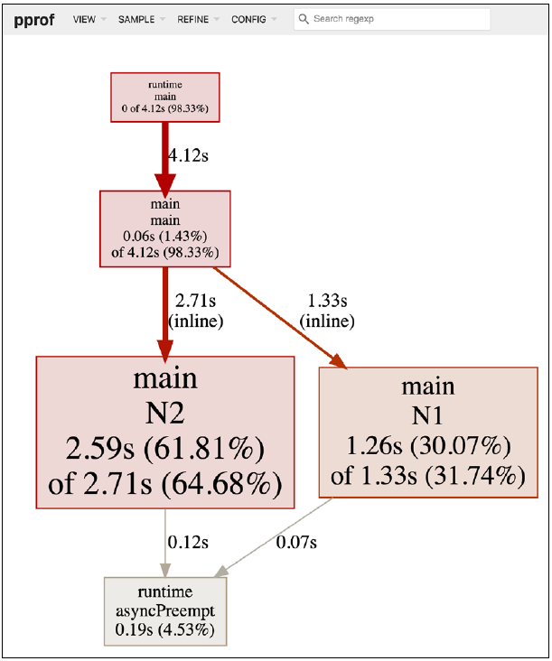

# Chapter 11: Code Testing and Profiling

Code optimization is the process where one or more developers try to make certain parts of a program run faster, be more efficient, or use fewer resources. 
Put simplly, code optimization is about eliminating the bottlenecks of a program that matter.

Code testing is about making sure that your code does what you want it to do.
The best time to write testing code is during development, as this can help to reveal bugs in the code as early as possible. 
Code profiling relates to measuring certain aspects of a program to get a detailed understanding of the way the code works. The results of code profiling may help you to decide which parts of your code need to change.

Have in mind that when writing code, we should focus on its correctness as well as other desirable properties such as readability, simplicity, and maintainability, not its performance. Once we are sure that the code is correct, then we might need to focus on its performance. A good trick on performance is to execute the code on machines that are going to be a bit slower than the ones that are going to be used in production.

## Optimizing code

There is no deterministic way to help you optimize your code and that you should use your brain and try many things if you want to make your code faster. However, the general principle regarding code optimization is first make it correct, then make it fast.

> The real problem is that programmers have spent far too much time worrying about efficiency in the wrong places and at the wrong times; premature optimization is the root of all evil (or at least most of it) in the programming.

Said by Donald Knuth

> Make it work, then make it beautiful, then if you really, really have to, make it fast. 90 percent of the time, if you make it beautiful, it will already be fast. So really, just make it beautiful.

Said by Joe Armstron,g one of the developers of Erlang.

## Benchmarking code 

Benchmarking measures the performance of a function or program, allowing you to compare implementations and to understand the performance impact of code changes. Using that information, you can easily reveal the part of the code that needs to be rewritten to improve its performance. 

\* Most of the time, the load of the operating system plays a key role in the performance of your code. 

Go follows certain conventions reggarding benchmarking. The most important convention is that the name of a benchmark function must begin with Benchmark. After the Benchmark word, we can put an underscore or an uppercase letter. The same rule applies to testing functions that begin with Test. By convention such functions are put in files that end with _test.go. Once the benchmarking or the testing code is correct, the go test subcommand does all the dirty work for you.

\* Benchmark functions use testing.B variables whereas testing functions use testing.T variables. 

How often do we need to create benchmark functions? The answer is simple: when something runs slower than needed and/ or when you want to choose between two or more implementations.

## Prifiling code

Profiling is a process of dynamic program analysis that measures various values related to program execution to give you a better understanding of the program behavior.

The runtime/pprof standard Go package is used for profilling all kinds of applications apart from HTTP servers. The high-level net/http/pprof package should be used when you want to profile a wweb application written in Go.

```
pprof.StartCPUProfile(cpuFile)
defer pprof.StopCPUProfile()
```

The previous code is about collecting CPU profiling data. pprof.StartCPUProfile()
starts the collecting, which is stopped with the pprof.StopCPUProfile() call.

And finally we should use go tool pprof to process these files. You can also create PDF output of the profiling data from the shell of the Go profiler using the pdf command. It gives you richer overview of the collected data.

### Profiling an HTTP server

```
r.HandleFunc("/debug/pprof/", pprof.Index)
r.HandleFunc("/debug/pprof/cmdline", pprof.Cmdline)
r.HandleFunc("/debug/pprof/profile", pprof.Profile)
r.HandleFunc("/debug/pprof/symbol", pprof.Symbol)
r.HandleFunc("/debug/pprof/trace", pprof.Trace)
```

All previous statements install the handlers for the HTTP profiler.

Go tool pprof comes with a web user interface that you can start as go tool pprof -http=[host]:[port] aProfile.out.



## The go tool trace utility 

Code tracing is a process that allows you to learn information such as the operation of the garbage collector, the lifetime of goroutines, the activiiity of each logical processor, and the number of operating system threads used.

The go tool trace utility is a tool for viewing the data stored in trace files, which can be generated in any one of the following three ways.

* WIth the runtime/trace package
* With the net/http/pprof package
* With the go test -trace command

```
err = trace.Start(f)
if err != nil {
fmt.Println(err)
    return
}

defer trace.Stop()
```

We start the tracing process using trace.Start(). When we are done, we call the trace.Stop() function.

```
go tool trace /path/ToTemporary/Directory/traceCLA.out
```

The last command automatically starts a web server and opens the web interface of
the trace tool on your default web browser.

Although go tool trace is very handy and powerful, it cannot solve every kind of performance problem. There are times where go tool pprof is more appropriate, especially when we want to reveal where our code spends most of its time.

As it happens with profiling, collecting tracing data for an HTTP server is a slightly different process.

### Tracing a web server from a client

```
trace := &httptrace.ClientTrace{
    GotFirstResponseByte: func() {
        fmt.Println("First response byte!")
    },

    GotConn: func(connInfo httptrace.GotConnInfo) {
        fmt.Printf("Got Conn: %+v\n", connInfo)
    },

    DNSDone: func(dnsInfo httptrace.DNSDoneInfo) {
        fmt.Printf("DNS Info: %+v\n", dnsInfo)
    },

    ConnectStart: func(network, addr string) {
        fmt.Println("Dial start")
    },

    ConnectDone: func(network, addr string, err error) {
        fmt.Println("Dial done")
    },

    WroteHeaders: func() {
        fmt.Println("Wrote headers")
    },
}
```

The preceding code is all about tracing HTTP requests. The httptrace.ClientTrace
structure defines the events that interest us, which are GotFirstResponseByte,
GotConn, DNSDone, ConnectStart, ConnectDone, and WroteHeaders. When such an
event occurs, the relevant code is executed. You can find more information about the supported events and their purpose in the documentation of the net/http/httptrace package.

```
req = req.WithContext(httptrace.WithClientTrace(req.Context(), trace))
fmt.Println("Requesting data from server!")
_, err := http.DefaultTransport.RoundTrip(req)
if err != nil {
    fmt.Println(err)
    return
}
```

The httptrace.WithClientTrace() function returns a new context value based
on the given parent context while http.DefaultTransport.RoundTrip() wraps the
request with the context value in order to keep track of the request.

