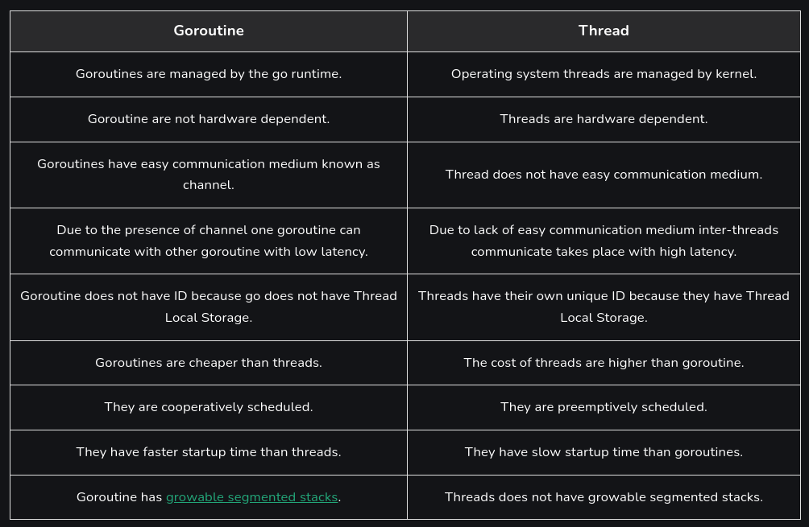
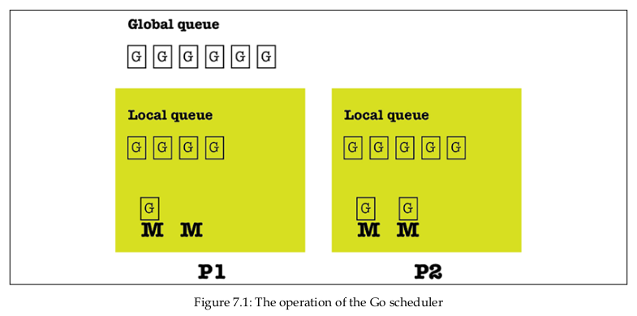
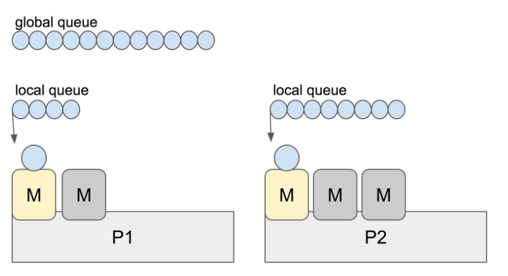
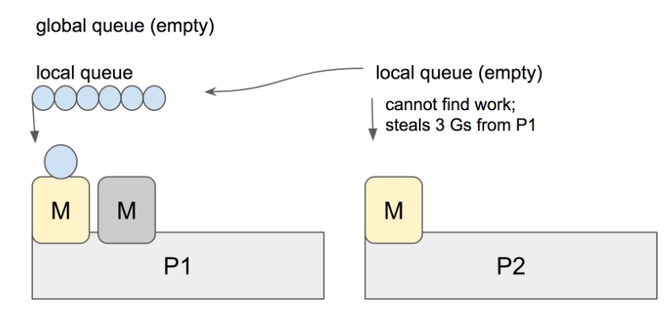

# Chapter 7: Go Concurrency

The key component of the Go concurrency model is the goroutine, which is the minimum executable entity in Go. Everything in Go is executed as a goroutine. Each executable Go program has at least one goroutine, which is used for running the main() function of the main package. Each goroutine is executed on a single OS thread according to the instructions of the Go scheduler, which is responsible for the execution of goroutines. The OS scheduler does not dictate how many threads the Go runtime is going to create because the Go runtime will spawn enough threads to ensure that GOMAXPOCS threads are available to run Go code. 

However, goroutines cannot directly communicate with each other. Data sharing in Go is implemented using either channels or shared memory. Channels act as the glue that connects multiple goroutines. Remember that although goroutines can process data and execute commands, they cannot communicate directly with each other, but they can communicate in other ways, including channels, local sockets, and shared memory. On the other hand, channels cannot process data or execute code but can send data to goroutines, receive data from goroutines, or have a special purpose.

## Processes, threads, and goroutines

A process is an OS representation of a running program, while a program is a binary file on disk that contains all the information necessary for creating an OS process. The binary file is written in a specific format and contains all the instructions the CPU is going to run as well as a plethora of other useful sections. That program is loaded into memory and the instructions are executed, creating a running process. 

A thread is a smaller and lighter entity than a process. Processes consist of one or more threads that have their own flow of control and stack. A quick and simplistic way to differentiate a thread from a process is to consider a process as the running binary file and a thread as a subset of a process.

A goroutine is the minimum Go entity that can be executed concurrently. The use of the word minimum is very important here, as goroutines are not autonomous entities like UNIX processes - goroutines live in OS threads that live in OS processes. The good thing is that goroutines are lighter than threads, which, in turn, are lighter than processes - running thousands or hundreads of thousands of goroutines on a single machine is not a problem. Among the reasons that goroutines are lighter than threds is because they have a smaller  stack that can grouw, they have a faster startup time, and they can communicate with each other through channels with low latency. In practice, this maens that a process can have multiple threads as well as lots of goroutines, whereas a goroutine needs the environment of a process to exist. So, to create a goroutine, you need to have a process with at least one thead. The OS takes care of the process and thread scheduling, while Go creates the necessary threds and the developer creates the desired number of goroutines. 

### Goroutine vs. Thread
Each operating system thread has a fixed-size block memory (sometimes as large as 2MB) for its stack, which is the work area where it saves the local variables of function calls that are in process or momentarily halted while another function is performed. This fixed-size stack is both too big and too small. A 2MB stack would be a tremendous waste of memory for a small goroutine that simply waits for a WaitGroup before closing a channel.

It is not uncommon for a Go program to generate hundreds of thousands of goroutines at once, which would be difficult to stack. Regardless of size, fixed-size stacks are not always large enough for the most complex and deeply recursive routines. Changing the fixed size can improve space efficiency and allow for the creation of more threads, or it can permit more deeply recursive algorithms, but not both.

A goroutine, on the other hand, starts with a modest stack, typically 2KB. The stack of a goroutine, like the stack of an OS thread, maintains the local variable of active and suspended function calls, but unlike the stack of an OS thread, the stack of a goroutine is not fixed; it grows and shrinks as needed. A goroutine stack’s size limit could be as much as 1GB, which is orders of magnitude larger than a conventional fixed-size thread stack; however, few goroutines use that much.

**Goroutines**<br>
Lightweight and concurrent units of execution in Go.

**Advantages of goroutines**:

a. Lightweight and efficient compared to OS threads.
b. Faster startup and lower memory consumption.
c. Easy to create and manage with the "go" keyword.
d. Ideal for concurrent programming and handling I/O-bound tasks.

**OS Threads:** <br>
Higher Memory Footprint: OS threads typically have a larger memory footprint compared to goroutines due to their underlying system structures and management overhead.
Context Switching Overhead: Context switching between OS threads incurs additional overhead as it requires system calls. This can impact the overall performance and scalability of an application.
Suitable for CPU-Intensive Tasks: OS threads are better suited for CPU-bound tasks that require intensive computation. They can fully utilize the available CPU cores, allowing parallel execution of computationally intensive workloads.
Manual Thread Management: With OS threads, developers have to manually manage thread creation, synchronization, and load balancing, which can be more complex and error-prone compared to goroutines.



## The Go scheduler
The OS kernel scheduler is responsible for the execution of the threads of a program. Similarly, the Go runtime has its own scheduler, which is responsible for the execution of the goroutines using a technique known as m:n scheduling, where m goroutines are executed using n OS threads using multiplexing. The Go scheduler is the Go component responsible for the way and the order in which the goroutines of a Go program get executed. 

The Go scheduler only deals with the goroutines of a single program, its operation is much simpler, cheaper, and faster than the operation of the kernel scheduler.

Go uses the fork-join concurrency model. The fork part of the model, which should not be confused with the fork(2) system call, states that a child branch can be created at any point of a program. Analogously, the join part of the Go concurrency model is where the child branch ends and joins with its parent. Keep in mind that both sync.Wait() statements and channels that collect the results of goroutines are join points, whereas each new goroutine creates a child branch.

The fair scheduling strategy, which is pretty straightforward and has a simple implementation, shares all load evenly among the available processors. At first, this might look like the perfect strategy because it does not have to take many things into consideration while keeping all processors equally occupied. However, it turns out that this is not exactly the case because most distributed tasks usually depend on other tasks. Therefore, some processors are underutilized, or equivalently, some processors are utilized more than others. A goroutine is a task, whereas everything after the calling statement of a goroutine is a continuation. In the work-stealing strategy used by the Go scheduler, a logical processor that is underutilized looks for additional work from other processors. 

When it finds such jobs, it steals them from the other processor or processors, hence the name. Additionally, the work-stealing algorithm of Go queues and steals continuations. A stalling join, as is suggested by ites name, is a point where a thread of execution stalls at a join and starts looking for other work to do. 

Alghough both task stealing and continuation stealing have stalling joins, continuations happen more often than tasks; therefore, the Go scheduling algorithm works with continuations rather than tasks. 

The main disadvantage of continuation stealing is that it requires extra work from the compiler of the programming language. Fortunately, Go provides that extra help and therefore uses continuation stealing in its work-stealing algorithm. One of the benefits of continuation stealing is that you get the same results when using function calss instead of goroutines or a single thread with multiple goroutines. This makes perfect sense, as only one thing is executed at any given point in both cases.

The Go scheduler works using three main kinds of entities: OS threads (M), which are related to the OS in use; goroutines (G); and logical processors (P). The number of processors that can be used by a Go program is specified by the value of the GOMAXPROCS environment variable. Now, let us return to the m:n scheduling algorithm used in Go. Strictly speaking, at any time, you have m goroutines that are executed, and therefore scheduled to run, on n OS threads using, at most, GOMAXPROCS number of logical processors.

The next figure shows that there are two different kinds of queues: a global run queue and a local run queue attached to each logical processor. Goroutines from the global queue are assigned to the queue of a logical processor in order to get executed at some point.



Each logical processor can have multiple threads, and the stealing occurs between the local queues of the available logical processors. Finally, keep in mind that the Go scheduler is allowed to create more OS threads when needed. OS threads are pretty expensive in terms of resources, which means that dealing too much with OS threads might slow down you Go applications.

**Go's work-stealing scheduler**<br>
Go scheduler’s job is to distribute runnable goroutines over multiple worker OS threads that runs on one or more processors. In multi-threaded computation, two paradigms have emerged in scheduling: work sharing and work stealing.

Work-sharing: When a processor generates new threads, it attempts to migrate some of them to the other processors with the hopes of them being utilized by the idle/underutilized processors.
Work-stealing: An underutilized processor actively looks for other processor’s threads and “steal” some.
The migration of threads occurs less frequently with work stealing than with work sharing. When all processors have work to run, no threads are being migrated. And as soon as there is an idle processor, migration is considered.

Go has a work-stealing scheduler since 1.1, contributed by Dmitry Vyukov. This article will go in depth explaining what work-stealing schedulers are and how Go implements one.

**Scheduling basics**<br>
Go has an M:N scheduler that can also utilize multiple processors. At any time, M goroutines need to be scheduled on N OS threads that runs on at most GOMAXPROCS numbers of processors. Go scheduler uses the following terminology for goroutines, threads and processors:

G: goroutine
M: OS thread (machine)
P: processor

There is a P-specific local and a global goroutine queue. Each M should be assigned to a P. Ps may have no Ms if they are blocked or in a system call. At any time, there are at most GOMAXPROCS number of P. At any time, only one M can run per P. More Ms can be created by the scheduler if required.



Each round of scheduling is simply finding a runnable goroutine and executing it. At each round of scheduling, the search happens in the following order:
```
runtime.schedule() {
    // only 1/61 of the time, check the global runnable queue for a G.
    // if not found, check the local queue.
    // if not found,
    //     try to steal from other Ps.
    //     if not, check the global runnable queue.
    //     if not found, poll network.
}
```
Once a runnable G is found, it is executed until it is blocked.

Note: It looks like the global queue has an advantage over the local queue but checking global queue once a while is crucial to avoid M is only scheduling from the local queue until there are no locally queued goroutines left.

**Stealing**<br>
When a new G is created or an existing G becomes runnable, it is pushed onto a list of runnable goroutines of current P. When P finishes executing G, it tries to pop a G from own list of runnable goroutines. If the list is now empty, P chooses a random other processor (P) and tries to steal a half of runnable goroutines from its queue.



In the case above, P2 cannot find any runnable goroutines. Therefore, it randomly picks another processor (P1) and steal three goroutines to its own local queue. P2 will be able to run these goroutines and scheduler work will be more fairly distributed between multiple processors.

### The GOMAXPROCS environment variable
The GOMAXPROCS environment variable allows you to set the number of OS threads (CPUs) that can execute user-level Go code simultaneously. Starting with Go version 1.5, the default value of GOMAXPROCS should be the number of logical cores available in you machine. 

### Concurrency and parallelism
It is a common misconception that concurrency is the same thing as parallelism. This is just not true! Parallelism is the simultaneous execution of multiple entities of some kind, whereas concurrency is a way of structuring your components so the they can be executed independently when possible.

It is only when you build software components concurrently that you can safely execute them in parallel, when and if your OS and your harware permit it. 

In a vlid concurrent design, adding concurrent entities makes the whole system run faster because more things can be executed in parallel. So, the desired parallelism comes from a better concurrent expression and implementation of the problem. The developer is responsible for taking concurrency into account during the desing phase of a system and will benefit from a potential parallel execution of the components of the system. So, the developer should not think about parallelism but about breaking the system. So, the developer should not think about parallelism but about breaking things into independent components that solve the initial problem when combined. 

## Goroutines
\* You cannot control or make any assumptions about the order in which you goroutines are going to be executed because that depends on the scheduler of the OS, the Go scheduler, and the load of the OS.

You can define, create, and execute a new goroutine using the go keyword followed by a function name or an anonymous function.

```
func main() {
    go func(x int) {
        fmt.Printf("%d ", x)
    }(10)
```

The (10) at the end is how you pass a parameter to an anonymous function.

```
go printme(15)
```

This is how you execute a function as a goroutine. As a general rule of thumb, the functions that you execute as goroutines do not return any values directly.

### Waiting for your goroutines to finish

As a Go program does not wait for its goroutines to end before exiting, we need to delay it manually. It is not enough to create multiple goroutines = you also need to wait for them to finish before the main() function ends.

\* goroutines are not always executed in the same order.

The synchronization process begins by defining a sync.WaitGroup variable and using the Add(), Done() and Wait() methods. If you look at the source code of the sync Go package, you see that the sync.WaitGroup type is nothing more than a structure with two fields:

```
type WaitGroup struct {
    noCopy noCopy
    state1 [3]uint32
}
```

Each call to sync.Add() increases a counter in the state1 field, which is an array with three uint32 elements. Notice that it is really important to call sync.Add() before the go statement in order to prevent any race conditions. When each goroutine finishes its job, the sync.Done() function should be executed in order to decrease the same counter by one. Behind the scenes, sync.Done() runs a Add(-1) call. The Wait() method waits until that counter becomes 0 in order to return. The return of Wait() inside the main() function means that main() is going to return and the program ends.

\* You can call Add() with a positive integer value other than 1 in order to avoid calling Add(1) multiple times. This can be handy when you know the number of goroutines you are going to create in advance. Done() does not support that functionality.

```
for i := 0; i < count; i++ {
    waitGroup.Add(1)
    go func(x int) {
        defer waitGroup.Done()
        fmt.Printf("%d ", x)
    }(i)
}

fmt.Printf("%#v\n", waitGroup)
waitGroup.Wait()
```

The Done() call is going to be executed just before the anonymous function returns because of the defer keyword.

\* The value in the third place of the state1 slice is the number of times which we called Add(1).

\* Remember that using more goroutines in a program is not a panacea for performance, as more goroutines, in addition to the various calls to sync.Add(), sync.Wait(), and sync.Done(), might slow doen your program due to the extra housekeeping that needs to be done by the Go scheduler.

\* Concurrent programs do not always crash or misbehave as the order of execution can change, which might change the behavior or the program. This makes debugging even more difficult.

## Channels
A channel is a communication mechanism that, among other things, allows goroutines to exchange data. Firstly, each channel allows the exchange of a particular data type, which is also called  the element type of the chanel, and secondly, for a channel to operate properly, you need someone to receive what is sent via the channel.

A pipeline is a virtual method for connecting goroutines and channels so that the output of one goroutine becomes the input of another goroutine using channels to transfer your data. One of the benefits that you get from using pipelines is that there is a constant data flow in your program, as no goroutine or channel has to wait for everything to be commpleted in order to start their execution. Additionally, you use fewer variables and therefore less memory space because you do not have to save everything as a variable. Finally, the use of pipelines simplifies the desing of the program and improves its maintainability.

### Writing to and reading from a channel
Writing the value val to channel ch is as easy as writing ch <- val. Additionally, reading a single value from a channel named c is like <- c

```
func main() {
    c := make(chan int, 1)
}
```

This channel is buffered with a size of 1. This means that as soon as we fill that buffer, we can close the channel, and the goroutine is going to continue its execution and return. A channel that is unbuffered has a different behavior. When you try to send a value to that channel, it blocks forever because it is waiting for someone to fetch that value. The following code shows a technique for determining whether a channel is closed or not.

```
_, ok := <-c
if ok {
    fmt.Println("Channel is open!")
} else {
    fmt.Println("Channel is closed!")
}
```

\* When trying to read from a closed channel, we get the zero value of its data type. Howeverm if you try to write to a closed channel, your program is going to crash in a bad way (panic).

### Channels as function parameters
When using a channel as a function parameter, you can specify its direction; that is, whether it is going to be used for sending or receiving data. In my opinion, if you know the purpose of a channel in advance, you should use this capability because it makes your programs more robust. If you try to perform an operation on a channel parameter that is not allowed, the Go compiler is going to complain. This happens even if the function is not being used.

## Race conditions
A data race condition is a situation where two or more running elements, such as threads and goroutines, try to take control of or modify a shared resource or shared variable of a program. Strictly speaking, a data race occurs when two or more instructions access the same memory address, where at least one of them performs a write operation. If all operations are read operations, then there is no race condition. In practice, this means that you might get different output if you run your program multiple times, and that is a bad thing.

Using the -race flag when running or building Go source files executes the Go race detector, which makes the compiler create a modified version of a typical executable file. This modified version can record all accesses to shared variables as well as all synchronization events that take place, including calls to sync.Mutex and sync.WaitGroup. After analyzing the relevant events, the race detector prints a report that can help you identify potential problems so that you can correct them.

## The select keyword
The select keyword is really important because it allows you to listen to multiple channels at the same time. In practice, this means that select allows a goroutine to wait on multiple communication operations. So, select gives you the power to listen to multiple channels using a single select block. 

A select statement is not evalueated sequentially, as all of its channels are examined simultaneously. If none of the channels in a select statement are ready, the select statement blocks(waits) until one of the channels is ready. If multiple channels of a select statement are ready, then the Go runtime makes a random selection from the set of these ready channels.

## Go channels revisited 

The zero value of the channel thpe is nil, and if you send a message to a closed channel, the program panics. However, if you try to read from a closed channel, you get the zero value of the type of that channel. So, after closing a channel, you can no longer write to it, but you can still read from it. To be able to close a channel, the channel must not be receive-only.

Additionally, a nil channel always blocks, which means that both reading and writing from nil channels blocks. Finally, if you try to close a nil channel, your program is going to panic.

### Buffered channels
The topic of this subsection is buffered channels. Thesse channels allow us to put jobs in a queue quickly in order to be able to deal with more request and process requests later on. Moerover, you can use buffered channels as semaphores in order to limit the throughput of your application. 

The presented technique works as follows: all incoming requests are forwarded to a channel, which processes them one by one. When the channel is done processing a request, it sends a message to the original caller saying that it is ready to process a new one. So, the capacity of the buffer of the channel restricts the number of simultaneous requests that it can keep.

### Worker pools
A worker pool is a set of threads that process jobs assigned to them. The Apache web server and the net/http package of Go more or less work this way: the main process accepts all incoming requests, which are forwarded to worker processes to get served. Once a worker process has finished its job, it is ready to serve a new client. As Go does not have threads, the presented implementation is going to use goroutines instead of threads. Additionally, threads do not usually die after serving a request because the cost of ending a thread and creating a new one is too high, whereas goroutines do die after finishing their job. Worker pools in Go are implemented with the help of buffered channels, because they allow you to llimit the number of goroutines running at the same time.

### Signal channels
A signal channel is one that is used just for signaling. Put simply, you can use a signal channel when you want to inform another goroutine about something. Signal channels should not be used for data transferring.

## Shared memory and shared variables
Shared memory and shared variables are huge topics in concurrent programming and the most common ways for UNIX threads to communicate with each other. The same principles apply to Go and goroutines. A mutex variable, which is an abbreviation of mutual exclusion variable, is mainly used for thread synchronization and for protecting shared data when multiple writes can occur at the same time. A mutex works like a buffered channel with a capacity of one, which allows at most one goroutine to access a shared variable at any given time. This means that there is no way for two or more goroutines to be able to update that variable simultabeously. Go offers the sync.Mutex and sync.RMMutex data types.

A critical section of a concurrent program is the code that cannot be executed simultaneously by all processes, threads, or, in this case, goroutines. It is the code that needs to be protected by mutexes. Therefore, identifying the critical sections of your code makes the whole programming process so much simpler that you should pay particular attention to this task. A critical section cannot be embedded into another critical section when both critical sections use the same sync.Mutex or sync.RWMutex variable.

### The sync.Mutex type

Here is an example usage of lock and unlock functions.

```
func read() int {
	m.Lock()
	a := v1
	m.Unlock()
	return a
}
```

\* If you lock a mutex without releasing it afterwards, this means that if we run another goroutine, all instances after the first one are going to be blocked waiting to Lock() the shared mutex. As expected, the program will be crashed because of the deadlock. To avoid such situations, always remember to unlock any mutexes created in your program.

### The sync.RWMutex type
With using sync.RWMutex you can have multiple readers owning a sync.RWMutex mutex This means that read operations are usually faster with sunc.RWMutex. However, there is one important detail that you should be aware of: until all of the readers of a sync.RWMutex mutex unlock that mutex, you cannot lock it for writing, which is the small price you have to pay for the performance improvement you get for allowing multiple readers.

## The atomic package
An atomic operation is an operation that is completed in a single step relative to other threads or, in this case, to other goroutines. This means that an atomic operation cannot be interrupted in the middle of it. The Go Standard library offers the atomic package, which, in some simple cases, can help you to avoid using a mutex. With the atomic package, you can have atomic counters accessed by multiple goroutines without synchronization issues and without worrying about race conditions. However, mutexes are more versatile than atomic operations.

When using an atomic variable, all reading and writing operations of an atomic variable must be done using the functions provided by the atomic package in order to avoid race conditions.

```
func (c *atomCounter) Value() int64 {
    return atomic.LoadInt64(&c.val)
}
```

## Sharing memory using goroutines
Although shared memory is the traditional way that threads communicate with each other, Go comes with built-in synchronization features that allow a single goroutine to own a shared piece of data. This means that other goroutines must send message to this single goroutine that owns the shared data, which prevents the corruption of the data. Such a goroutine is called a monitor goroutine. In Go terminology, this is sharing by communication instead of communicating by sharing. 

## Closured variables and the go statement
Notice that closured variables in goroutines are evaluated when the goroutine actually runs and when the go statement is executed.

```
func main() {
    for i := 0; i <= 20; i++ {
        go func() {
            fmt.Print(i, " ")
        }()
    }

    time.Sleep(time.Second)
    fmt.Println()
}

// the result would be something like 
// 3 7 21 21 21 21 21 21 21 21 21 21 21 21 21 21

// As i is a closured variable, it is evaluated at the time of execution. As the goroutines begin but wait for the Go scheduler to allow them to get executed, the for loop ends.
```

## The context package
The main purpose of the context packae is to define the Context type and support cancellation. There are times when, for some reason, you want to abandon what you are doing. However, it would be very helpful to be able to include some extra information about your cancellation decisions. The context package allows you to do exactly that.

We use context.Background() to initialize an empty context. 

The WichCancel() method returns a copy of parent context with a new Done channel. Notice that the cancel variable, which is a function, is one of the return values of context.CancelFunc(). The context.WithCancel() function uses an existing Context and creates a child with cancellation. The context.WithCancel() function also returns a Done channel that can be closed, either when the cnacel() function is called or when the Done channel of the parent context is closed.

The context.WithTimeout() requires two parameters: a Context parameter and a time.Duration parameter. When the timeout period expires the cancel() function is called automatically.

Context.WithDeadline() requires two parameters: a Context variable and a time in the futuer that signifies the deadline of the operation. When the deadline passes, the cancel() function is called automatically.

\* You can pass values in a context and use it as a key-value store.
